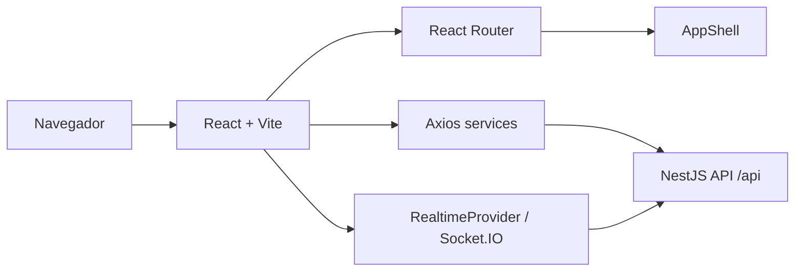

# TSEA Frontend

Frontend React/Vite do TSEA. A interface consome a API NestJS, exibe dados operacionais em tempo real, permite operar processos, acompanhar alarmes, gerar/previsualizar/download de relatorios, administrar configuracoes e gerenciar usuarios conforme perfil de acesso.

## Visao Geral

O frontend roda por padrao em `http://127.0.0.1:5173` ou `http://localhost:5173` e conversa com a API em `http://localhost:3000/api`.



## Funcionalidades

| Area | Funcionalidades |
| --- | --- |
| Autenticacao | Login, primeiro acesso, esqueci senha e redefinicao de senha. |
| Dashboard | Visao geral operacional e indicadores. |
| Processos | Listagem, detalhes, pre-checagem e operacoes de processo. |
| Alarmes | Listagem, filtros, graficos, resolucao e geracao de relatorio. |
| Historico | Consulta de eventos e rastreabilidade operacional. |
| Relatorios | Listagem, metadados, preview de PDF/XLSX e download. |
| Configuracoes do Sistema | Parametros gerais do sistema. |
| MQTT/Hardware | Estado de conexao, hardware, sensores, valvulas e configuracoes MQTT. |
| Tanques e Bombas | Cadastro/gestao de recursos fisicos configuraveis. |
| Backups | Criacao, consulta e restauracao de backups de configuracoes. |
| Usuarios | Gestao de usuarios, perfis, informacoes e graficos. |

## Rotas

| Rota | Acesso |
| --- | --- |
| `/login` | Publica. |
| `/forgot-password` | Publica. |
| `/reset-password` | Publica. |
| `/first-access` | Usuario autenticado em primeiro acesso. |
| `/dashboard` | Usuario autenticado. |
| `/processos` | `OPERADOR`, `TECNICO`, `ADMINISTRADOR`. |
| `/alarmes` | `OPERADOR`, `TECNICO`, `ADMINISTRADOR`. |
| `/historico` | `OPERADOR`, `TECNICO`, `ADMINISTRADOR`. |
| `/relatorios` | `OPERADOR`, `TECNICO`, `ADMINISTRADOR`. |
| `/configuracoes/sistema` | `TECNICO`, `ADMINISTRADOR`. |
| `/configuracoes/mqtt-hardware` | `TECNICO`, `ADMINISTRADOR`. |
| `/configuracoes/tanques` | `TECNICO`, `ADMINISTRADOR`. |
| `/configuracoes/bombas` | `TECNICO`, `ADMINISTRADOR`. |
| `/configuracoes/backups` | `ADMINISTRADOR`. |
| `/usuarios` | `ADMINISTRADOR`. |

## Navegacao

A navegacao principal e definida em `src/config/navigation.ts` e reaproveitada pelo layout desktop e pelo menu mobile. O menu mobile usa painel/overlay para exibir a estrutura completa em telas pequenas, mantendo a sidebar/topbar no desktop.

## Comunicacao com API

O Axios centralizado usa:

- `VITE_API_BASE_URL`, quando definida.
- `VITE_API_URL`, como compatibilidade.
- Fallback: `http://localhost:3000/api`.

Tokens JWT sao enviados no header `Authorization: Bearer <token>` quando o usuario esta autenticado.

## Tempo Real

O frontend possui camada Socket.IO centralizada em `src/services/realtime`. Eventos tipados cobrem MQTT/hardware, processos e alarmes.

Eventos MQTT/hardware relevantes:

- `mqtt:connection-status`
- `mqtt:error`
- `hardware:state`
- `sensor:reading`
- `hardware:status`
- `hardware:heartbeat`
- `alarm:created`
- `sensor-acoplamento:updated`

Eventos de processos relevantes:

- `process:created`
- `process:started`
- `process:paused`
- `process:resumed`
- `process:finished`
- `process:interrupted`
- `process:failure`
- `process:precheck-result`
- `process:status-changed`

Eventos de alarmes relevantes:

- `alarm:resolved`
- `alarm:dashboard-updated`
- `alarm:notification`

## Tecnologias

| Tecnologia | Uso |
| --- | --- |
| React | Componentes e estado da interface. |
| Vite | Dev server e build. |
| TypeScript | Tipagem do frontend. |
| React Router | Rotas publicas, privadas e protegidas por perfil. |
| Axios | Cliente HTTP para a API. |
| Socket.IO Client | Atualizacoes em tempo real. |
| Recharts | Graficos e indicadores visuais. |
| Framer Motion | Animacoes de interface. |
| Lucide React | Icones. |
| Sass | Estilos SCSS. |
| React Hook Form + Zod | Formularios e validacao. |

## Variaveis de Ambiente

Exemplo sem segredos reais:

```env
VITE_API_BASE_URL=http://localhost:3000/api
VITE_SOCKET_URL=http://localhost:3000
```

Observacoes:

- A porta frontend validada do projeto e `5173`.
- Nao versionar `.env` com tokens ou credenciais reais.

## Como Executar

```powershell
npm install
npm run dev
```

URLs esperadas:

- `http://127.0.0.1:5173`
- `http://localhost:5173`

## Scripts

| Script | Descricao |
| --- | --- |
| `npm run dev` | Inicia o Vite em desenvolvimento. |
| `npm run build` | Executa TypeScript build e Vite build. |
| `npm run lint` | Executa ESLint no projeto. |
| `npm run preview` | Serve o build localmente para revisao. |

## Estrutura

| Pasta | Uso |
| --- | --- |
| `src/api` | Cliente Axios e configuracoes HTTP. |
| `src/components` | Componentes reutilizaveis de UI. |
| `src/config` | Configuracoes compartilhadas, como navegacao. |
| `src/context` | Contextos globais, incluindo autenticacao e realtime. |
| `src/hooks` | Hooks de paginas e regras reutilizaveis. |
| `src/layout` | AppShell, sidebar, topbar e navegacao mobile. |
| `src/pages` | Telas principais do sistema. |
| `src/routes` | Rotas publicas/privadas/protegidas. |
| `src/services` | Services HTTP e realtime. |
| `src/styles` | Estilos globais e SCSS compartilhado. |
| `src/types` | Tipos TypeScript compartilhados. |

## Observacoes

- As permissoes visuais devem acompanhar as roles retornadas pela API.
- Relatorios PDF/XLSX devem usar dados reais da API e os endpoints de preview/download.
- A documentacao acima reflete os arquivos existentes no projeto nesta revisao.
